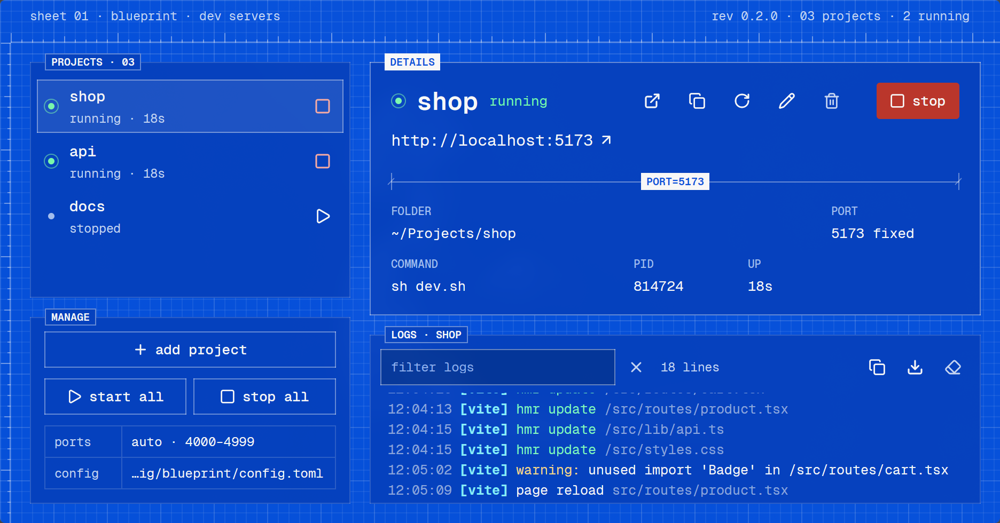

# blueprint

A desktop app for running many dev servers at once. Each project gets its own port
(fixed, or picked for it), live logs, and a link to `http://localhost:PORT`.



Built with Rust and [GPUI](https://www.gpui.rs) (through `gpui-kit`), drawn like a blueprint:
solid blue panels on a `#0552e1` field with a fine white grid, set entirely in Geist Mono.
Lines come in three weights (hairline, line, solid ink), and only the details sheet and the
main action are solid ink, so the eye always has one place to land.

## Requirements

- Linux (Wayland or X11) or Windows
- Whatever your projects use (Node, Cargo, Python, ...). Nothing else.
- To build from source: a Rust toolchain, plus on Linux the usual GPU and windowing
  headers (on Debian/Ubuntu: `pkg-config libxkbcommon-dev libxkbcommon-x11-dev libxcb1-dev
  libx11-xcb-dev libwayland-dev libvulkan-dev libfontconfig1-dev libfreetype-dev`)

## Install

Download the latest release from the
[releases page](https://github.com/radiumcoders/BluePrint/releases):

- **Linux**: `blueprint-<version>-linux-x86_64.AppImage`. Make it executable and run it:
  `chmod +x blueprint-*.AppImage && ./blueprint-*.AppImage`. It needs glibc 2.35 or newer
  (Ubuntu 22.04, Fedora 36, Arch and later), plus `libfuse2` for AppImages in general.
- **Windows**: `blueprint-<version>-windows-x86_64.zip` or the plain `.exe`. It isn't
  code-signed, so SmartScreen asks first: "More info → Run anyway".

Or build it from source. Install straight from the repository:

```sh
cargo install --git https://github.com/radiumcoders/BluePrint
blueprint
```

or clone it first, to build a particular version or work on it:

```sh
git clone https://github.com/radiumcoders/BluePrint.git
cd BluePrint
cargo install --path .     # or `cargo run --release` to try it without installing
```

`cargo install` puts `blueprint` in `~/.cargo/bin` (`%USERPROFILE%\.cargo\bin` on Windows),
which needs to be on your `PATH`.

## Using it

- **Add a project**: click "add project" or press `N`. Pick a folder from your projects
  directory (type to filter, Enter picks the first match) or use "browse…" for any folder.
  - **name**: what the project is called in the list. It defaults to the package.json name
    or the folder name.
  - **port**: a fixed port for the dev server. Leave it blank and blueprint picks a free one
    from 4000–4999, keeping the same one across restarts while it's free.
  - **command**: filled in from the folder (see below). Leave it blank to run the
    package.json `dev` script, or enter anything, like `pnpm dev`. Shell syntax (`&&`, `|`,
    `$PORT`) works.
- **Run them**: start and stop each project from its row, or with "start all"/"stop all".
  Run as many as you like. A project shows *starting* until its server accepts connections,
  then *running*.
- **Details and logs**: select a project to see its URL, folder, port, command, PID and
  uptime, plus its live, colored logs. The console keeps the last 5000 lines and follows
  the newest until you scroll up ("latest" jumps back). Filter it with `/` or `Ctrl+F`
  (case-insensitive; `Esc` clears), and copy or save the lines shown as plain text.
- **Editing a running project** changes nothing until you restart it: the details keep
  showing the port, URL and command it runs with, marked "edited, restart to apply".

| Key | Action |
| --- | --- |
| `↑` `↓` | select project |
| `Enter` / `Space` | start / stop |
| `N` | add project |
| `E` | edit |
| `R` | restart |
| `O` | open in browser |
| `Delete` | remove (press twice) |
| `Alt+↑` `Alt+↓` | reorder |
| `/` or `Ctrl+F` | filter logs |
| `Esc` | close dialog / clear filter |

Closing the window stops every server.

## Config

The config is stored at `~/.config/blueprint/config.toml`. Set `BLUEPRINT_CONFIG` to use a different file.

```toml
projects_root = "~/Projects"   # where the add dialog looks for folders

[[projects]]
name = "shop"
path = "~/Projects/shop"
port = 3000                    # optional
command = "pnpm dev"           # optional
```

## How it works

- Each project's command runs through `sh -c` (`cmd.exe` on Windows) in its folder, with
  its port in the `PORT` environment variable. The logs start with the exact command, e.g.
  `$ PORT=4001 pnpm dev --port $PORT`.
- A blank command runs the package.json `dev` script with the project's package manager
  (from its lockfile). Vite, Astro, Angular, React Router, Remix and Expo ignore `PORT`, so
  blueprint adds `--port $PORT` for them (and `--strictPort` for Vite, so it fails instead of
  quietly moving to another port). Next, Nuxt and most others read `PORT` themselves.
- Not just Node: picking a folder fills in a start command for Rust (`cargo run`, Trunk,
  Dioxus, Leptos, Zola), Go (`go run .`, Air, Hugo), Python (Django, FastAPI, Flask,
  Streamlit, with uv or Poetry), Ruby (Rails, Rack), PHP (Laravel, `php -S`), Phoenix,
  Deno and static folders. A plain `cargo run` or `go run .` app must read `PORT` itself.
- Started from an app launcher, blueprint imports your login shell's `PATH` so tools
  installed through mise, cargo, bun or go are found.
- **No orphaned servers**: each server runs in its own process group (a job object on
  Windows), and stopping it stops the whole group: SIGTERM, then SIGKILL after 4 seconds.
  If a command exits but leaves processes behind, they get the same treatment, and the
  project shows *stopping* until they're gone. A small guardian process
  (`blueprint --guardian`) watches a pipe from blueprint; if blueprint exits for any reason,
  including a crash or `kill -9`, it stops every server the same way. On Windows the system
  kills the job objects when blueprint exits.

## What is guaranteed, and what isn't

Some behavior is checked by tests on Linux and Windows for every change. Some is a best
guess that works for common setups. This section says which is which.

**Statuses.** *Running* means something accepts TCP connections on `localhost:PORT`
(127.0.0.1 or ::1). It does not mean the app is healthy: blueprint doesn't speak HTTP to it,
so a server that accepts connections but answers with errors still shows *running*. Running
servers are checked every 2 seconds, and two failed checks in a row turn the status into
*not responding*. There is no startup timeout. A server that hasn't accepted a connection
after 60 seconds gets a warning in its logs (usually it isn't listening on `$PORT`), but it
keeps running, because a first build can take longer than that.

**Start recipes.** Detection only suggests a command; you can always change it. Tested end
to end (started for real, answered over HTTP, port free after stopping): a package.json dev
script that reads `PORT`, a Vite-style tool that has to be passed `--port`, a static site
served by Python, and a Go module. Every other recipe (Rust, Hugo, Air, Django, FastAPI,
Flask, Streamlit, Rails, Rack, Laravel, PHP, Phoenix, Deno) is checked only for the command
it suggests, so whether that tool honors the port is up to the tool and its version.

**Network exposure.** Recipes keep servers on localhost: where a tool would listen on every
interface by default (Python's `http.server`, Streamlit), the suggested command binds it to
127.0.0.1. Commands you write yourself are run as written.

**Stopping (tested).** Stop, restart, remove and quit end the whole process tree, including
children that ignore SIGTERM and processes left behind by a command that already exited.
On Unix, a process that moves itself out of the process group (`setsid`, daemons, Docker
containers run by the Docker daemon) isn't tracked. On Windows, stopping kills the tree at
once, because a windowless app can't ask console programs to close politely.

**Logs (tested).** Each project keeps its newest 5000 lines, up to 4 MiB. Lines longer than
4 KiB are cut and marked `…[cut]`. Invalid UTF-8 and stray escape sequences are shown, never
fatal. A server that writes faster than the window takes output in has to wait (as it would
writing to a slow terminal) instead of blueprint's memory growing.

**Commands on Windows.** Commands are written the way `sh` reads them and translated for
`cmd.exe`: `$NAME` and `${NAME}` become `%NAME%`, `NAME=value` before a command becomes
`set "NAME=value" &&`, single quotes become double quotes, `;` becomes `&`, and `/dev/null`
becomes `NUL`. `&&`, `||`, pipes, redirections and backslash paths pass through. Commands
using `$(...)`, backticks, `${NAME:-default}` or here-documents don't start, with an error
naming the problem. Two known gaps: `%NAME%` in a command still expands as in `cmd.exe`, and a
variable set before one command in a chain stays set for the rest of the chain.

## Troubleshooting

- **A project stays on *starting*.** Its server isn't listening on the port blueprint gave
  it. Check the first log line for the port, then make sure the command passes `$PORT` or
  the app reads the `PORT` variable. A fixed port in the project settings helps when a tool
  insists on its own.
- **"Port N is already in use".** Something else holds that fixed port, maybe an earlier run
  started outside blueprint. Find it with `lsof -i :N` (Linux) or `netstat -ano | findstr :N`
  (Windows), or leave the port blank to have one picked.
- **"command not found" when launched from the app menu, but it works in a terminal.**
  blueprint asks your shell for its `PATH` (`$SHELL -lic`, an interactive login shell) and
  adds common tool folders (mise shims, `~/.cargo/bin`, `~/.bun/bin`, `~/go/bin`, ...).
  A tool is still missed if your shell only adds it in a file that kind of shell doesn't
  read (for bash, a `.bashrc` that `.bash_profile` doesn't source), or if the shell takes
  more than a few seconds to start. Use the tool's full path in the command, or start
  blueprint from a terminal.
- **A command fails on Windows only.** See *Commands on Windows* above; the log shows the
  error if the command couldn't be translated.
- **A server was left running after blueprint closed.** That shouldn't happen. If it does,
  please open an issue with the project's command and platform.
- **Where's my config?** `~/.config/blueprint/config.toml` (Linux) or
  `%APPDATA%\blueprint\config.toml` (Windows), unless `BLUEPRINT_CONFIG` points elsewhere.
  The path is also shown in the *manage* box.

## Development

```sh
cargo test                            # unit tests and stand-in server tests; nothing to install
cargo test -- --include-ignored       # also the end-to-end tests, which need node, npm,
                                      # python (python3 on Linux) and go on PATH
cargo clippy --all-targets -- -D warnings
```

CI runs all of it on Linux and Windows for every push and pull request.

## Fonts

[Geist Mono](https://github.com/vercel/geist-font) is bundled under the SIL Open Font License. See `assets/fonts/`.
